# MLOps Platform Technical Assignment

## Role Level
G13

## Problem Statement
The objective of this project is to build a representative, robust MLOps application utilizing a Python backend and an Angular GUI. The platform provides full-lifecycle model management, including capabilities to register, version, approve, deploy, monitor, and seamlessly roll back machine-learning models. It features strong guardrails ensuring that unapproved or archived models cannot be deployed to sensitive environments.

## Architecture Summary
The system is divided into two primary tiers:
- **Backend**: A FastAPI application that handles business logic, state transitions (like approving or archiving versions), simulated asynchronous deployments, and metric delivery. It integrates with a PostgreSQL database via SQLAlchemy.
- **Frontend**: A standalone Angular 18 Single-Page Application (SPA) leveraging Angular Material for a responsive, modern UI. State and API integration are managed cleanly via RxJS and Angular's HTTP Client.

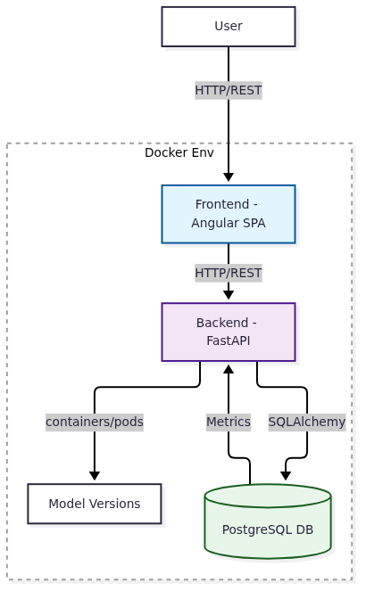

The entire application runs in isolated, orchestrated Docker containers for identical development and production behaviors.

## Technology Stack
- **Backend:** Python 3.11+, FastAPI, SQLAlchemy, PostgreSQL, Pytest
- **Frontend:** Angular 18, TypeScript, Angular Material, RxJS, Vitest, Playwright
- **Infrastructure:** Docker, Docker Compose

## Setup and Run Instructions
1. Clone the repository.
2. Set up the environment variables by copying the example file:
   ```bash
   cp .env.example .env
   ```
3. Run the application using Docker Compose (this provisions both the frontend, backend, and database containers):
   ```bash
   docker compose up --build
   ```
4. Access the Angular UI at `http://localhost:4200`
5. Access the backend API at `http://localhost:8000`

## Test Commands
A comprehensive test suite validates end-to-end functionality, from backend business logic to component rendering and automated browser interaction.

- **Backend (Unit & Integration):** 
  ```bash
  cd backend
  pytest
  ```
- **Frontend (Component Tests):**
  ```bash
  cd frontend
  npm run test
  ```
- **Frontend (Playwright E2E):**
  ```bash
  cd frontend
  npx playwright test
  ```

## API Documentation Location
The interactive Swagger/OpenAPI documentation is available at: 
http://localhost:8000/docs

## UI Screenshots

<details>
<summary><b>Model Inventory</b></summary>
<br>
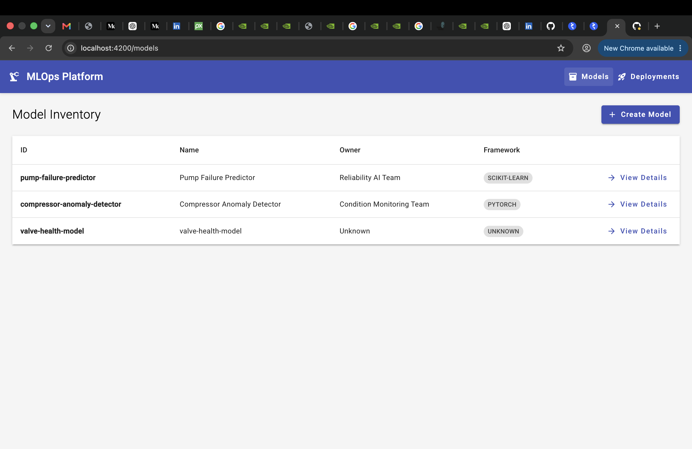
</details>

<details>
<summary><b>Create Model</b></summary>
<br>
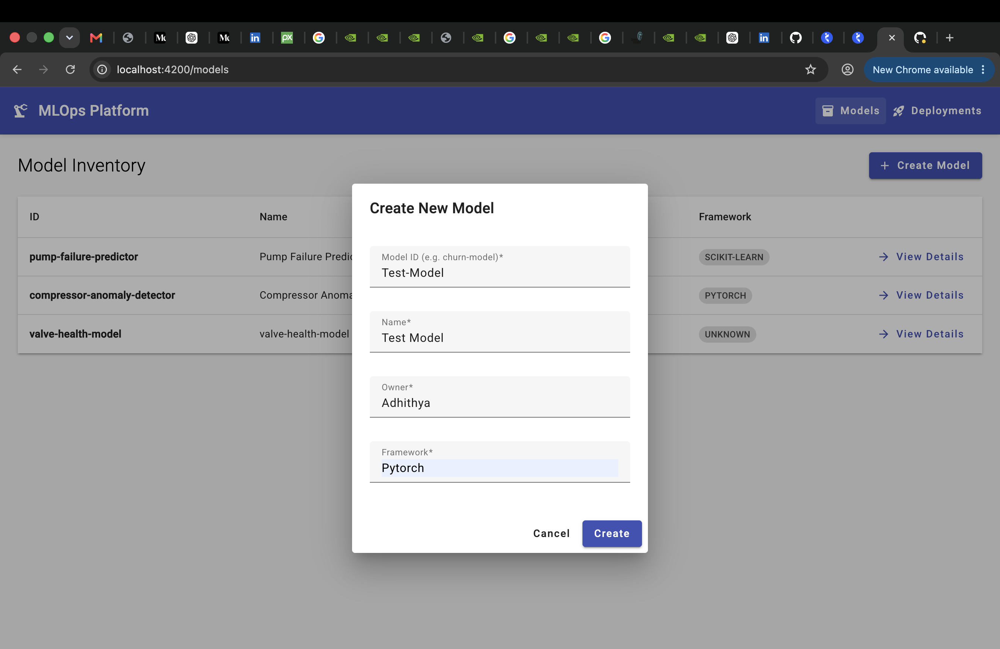
</details>

<details>
<summary><b>Model Created</b></summary>
<br>
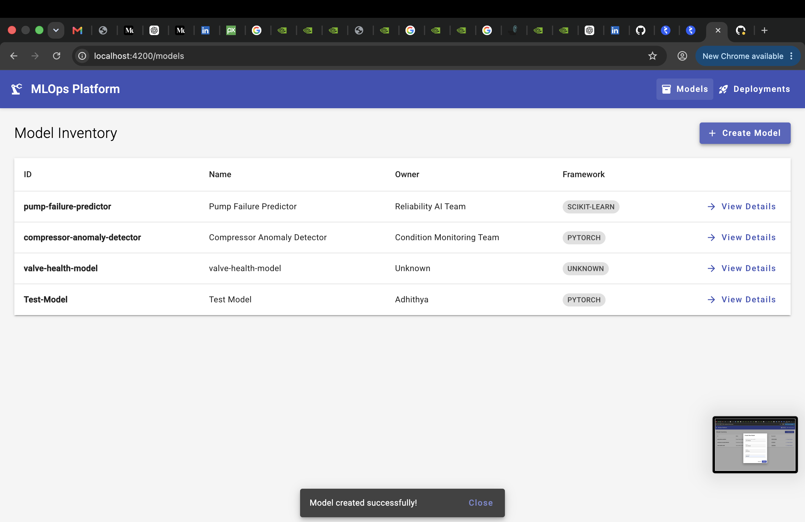
</details>

<details>
<summary><b>Create Version</b></summary>
<br>
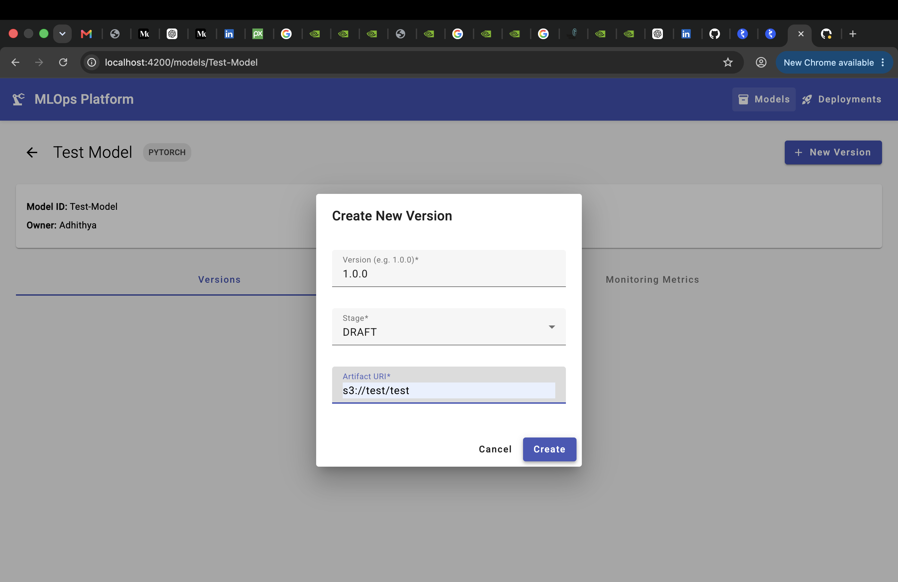
</details>

<details>
<summary><b>Version Created</b></summary>
<br>
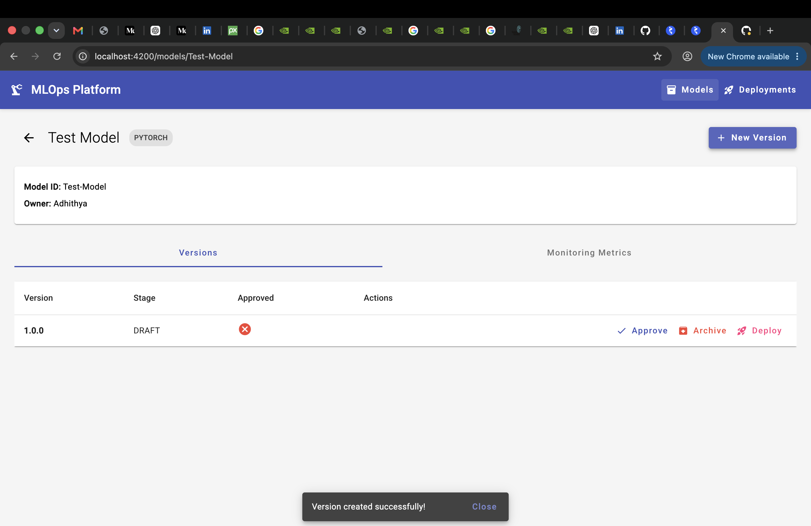
</details>

<details>
<summary><b>Version Approved</b></summary>
<br>
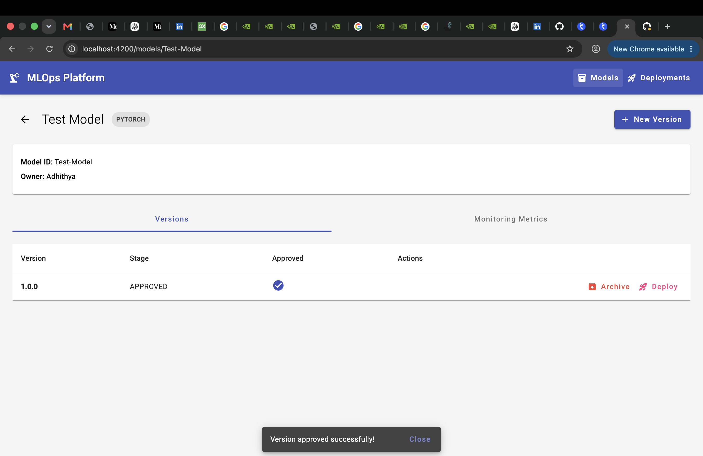
</details>

<details>
<summary><b>Deployment Requested</b></summary>
<br>
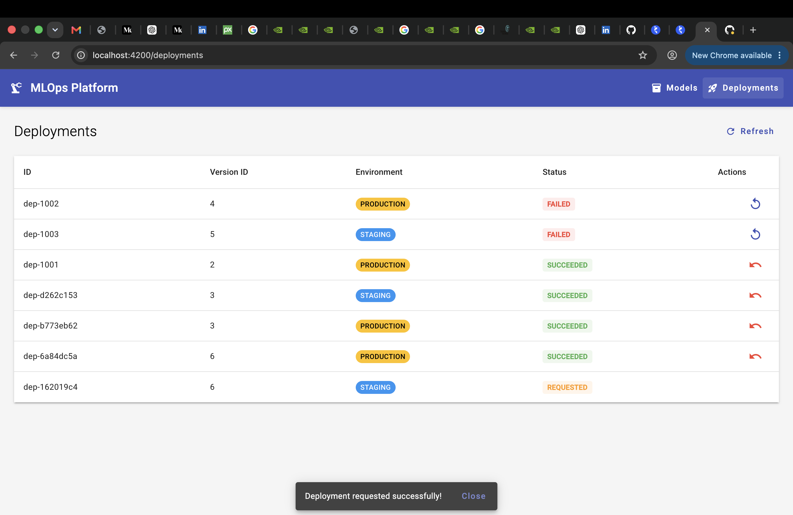
</details>

<details>
<summary><b>Deployment Validating Stage</b></summary>
<br>

</details>

<details>
<summary><b>Deploying Stage</b></summary>
<br>
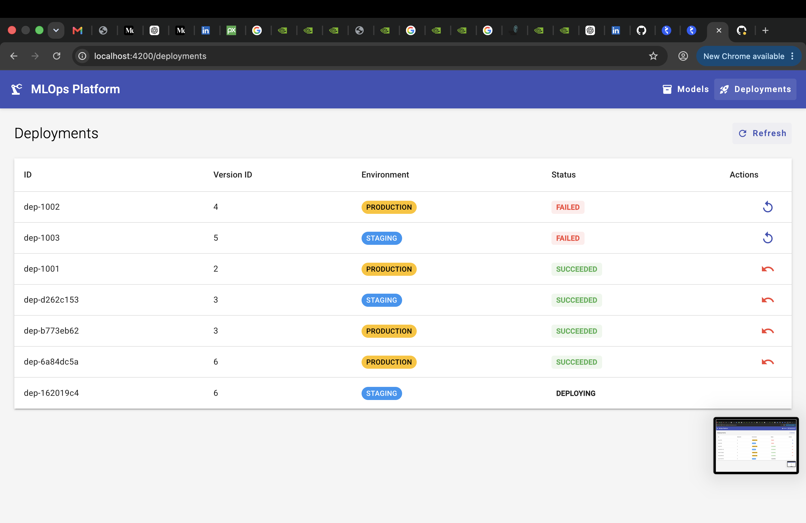
</details>

<details>
<summary><b>Cannot Deploy Archived</b></summary>
<br>
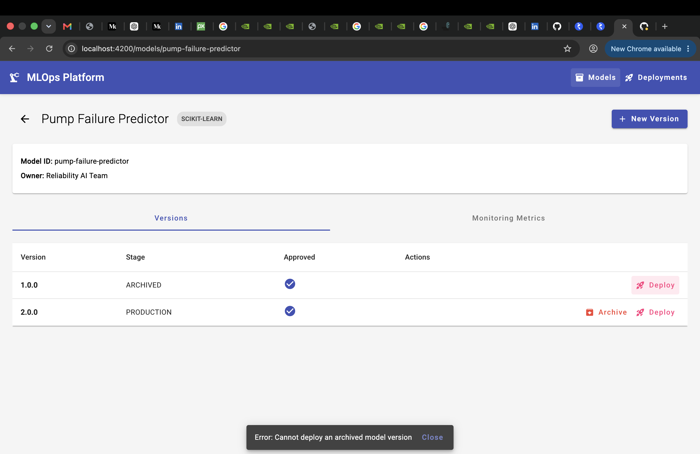
</details>

<details>
<summary><b>Cannot Deploy Unapproved</b></summary>
<br>
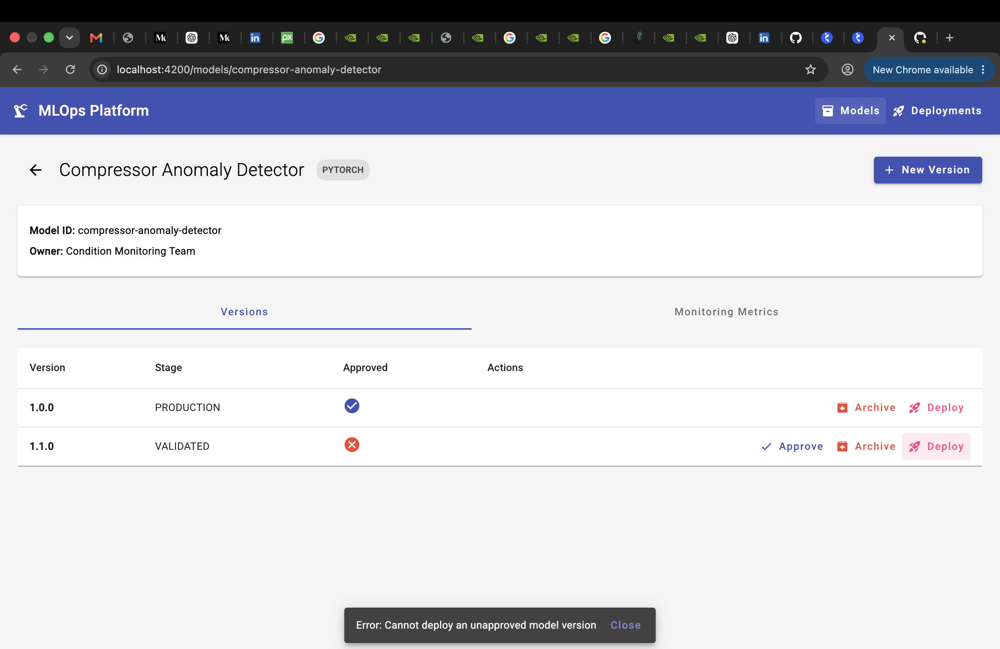
</details>

<details>
<summary><b>Metrics Page</b></summary>
<br>
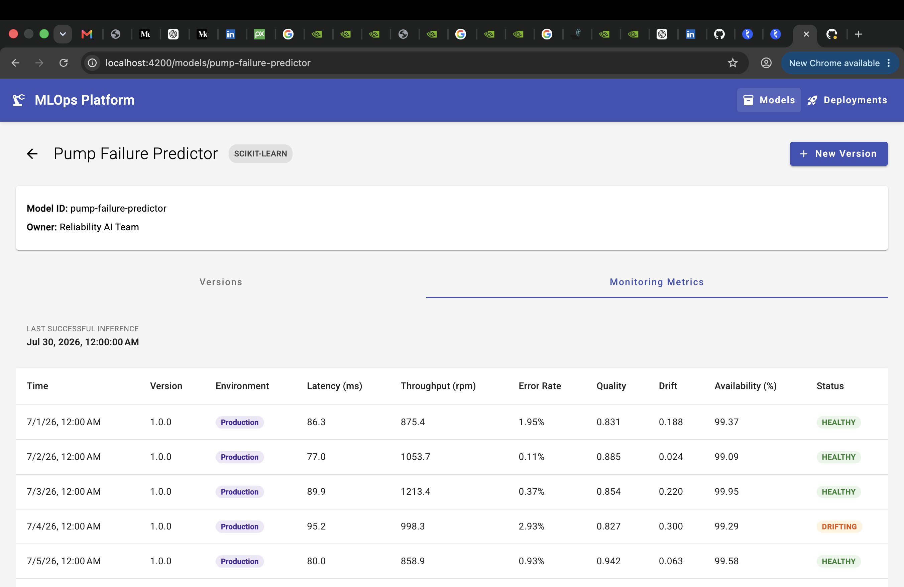
</details>

<details>
<summary><b>CI Tests Passing in GitHub</b></summary>
<br>
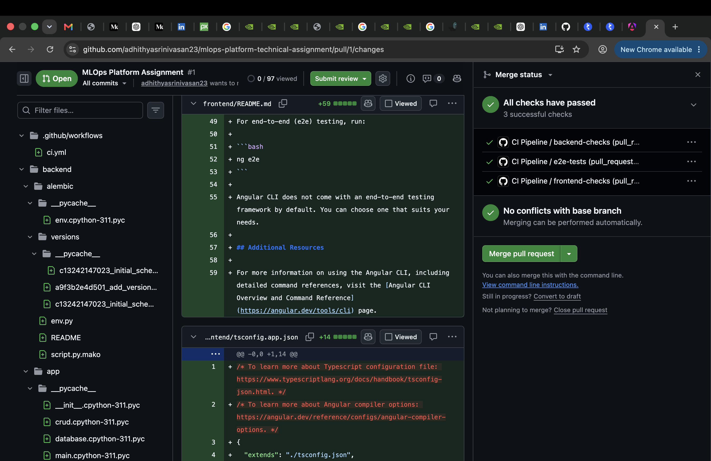
</details>

## Sample Workflows
To test the core acceptance scenarios, follow this flow:
1. **Explore Inventory**: Visit `http://localhost:4200/models` to see registered models.
2. **Register Version**: Click into a model, and click **New Version**. Fill out the artifact URI and set stage to DRAFT.
3. **Approve**: Once created, click the **Approve** button on the new version row.
4. **Deploy**: Click the **Deploy** button. Wait ~10 seconds while the simulated deployment runs. You can watch the status transition to `SUCCEEDED` on the Deployments tab.
5. **Rollback**: To rollback a successful deployment, go to the Deployments tab and click the **Rollback** button, which seamlessly initiates a safe regression to the prior deployment.

## Known Limitations
- The deployment flow is simulated via background tasks. It does not actively spin up Kubernetes pods or provision cloud infrastructure.
- The application does not currently implement authentication and granular Role-Based Access Control (RBAC).
- Delete operations for models and model versions are not currently supported.
- During a deployment rollback, the user cannot select a specific version to roll back to (it automatically defaults to the previous stable state).

## Future Improvements
- **Features**: Add support for model deletion and enable users to choose specific target versions when performing rollbacks.
- **Security**: Integrating Auth0 or Firebase Auth for secure login and permission management.
- **Advanced Monitoring**: Real-time WebSocket subscriptions to stream model metrics to the frontend dynamically.
- **Production CI/CD**: Adding GitHub Actions workflows for continuous automated testing and deployment.
